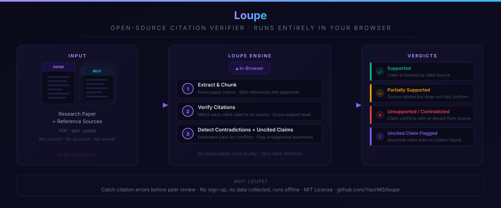

# Loupe — AI Research Paper Citation & Reference Verifier

**Loupe** is a free, open-source tool that checks whether a research paper's citations actually say what the paper claims they say. Upload a paper and its reference sources, and Loupe cross-references every cited claim against them, flags claims made with no citation at all, and runs a dedicated pass to hunt for outright contradictions between the paper and its own sources — entirely in your browser, using your own AI provider API key.

No account, no upload to a third-party server, no internet search. It's a citation-accuracy checker and reference-verification tool for anyone who needs to sanity-check a paper, literature review, thesis chapter, or AI-assisted draft before it goes out the door: authors, reviewers, editors, and students.

**[Try it now — loupe.yasirmo.me](https://loupe.yasirmo.me/)**, no install. See [Using it](#using-it) for the local-dev and desktop-app options too.

> If you searched "Loupe" and landed here expecting a jeweler's magnifying glass — that's exactly where the name comes from. This is that same idea of close, careful examination, applied to a paper's citations.

## What it does

Loupe reads through a paper and splits its claims into three things worth knowing:

- **Cited claims** — anything with an in-text citation gets checked against your uploaded sources, with a verdict (supported / partial / unsupported / contradicted), a quoted excerpt as evidence, and a confidence level.
- **Claims with no citation** — factual-sounding statements with nothing attached, surfaced separately so you can confirm they're your own analysis rather than something that quietly needed a source.
- **Contradictions** — a dedicated adversarial pass that specifically hunts for places where a source says the opposite of what the paper claims, since that's a different search than "does this support the claim?" and gets missed if you only ask one question.

Long papers are split into chunks so every cited claim gets checked — not just a top handful — and a run that gets interrupted (rate limit, network drop, ran out of tokens) saves its progress automatically, so you can resume instead of starting over.

## Privacy — read this first

Loupe has no backend and no account system. Everything — reading your paper, reading your sources, calling the AI provider, showing you the results — happens in your own browser tab.

- **We do not keep your API key.** It's stored only in your own browser's `localStorage`, on your own device. It is never sent to us, because there is no "us" to send it to — Loupe doesn't run a server at all.
- **Your paper and sources never leave your machine except to the AI provider you pick.** Whatever provider you choose (Anthropic, OpenAI, Google, Groq, OpenRouter, Hugging Face, or your own local model) is the only place your text or your key is ever sent, directly from your browser.
- **You are responsible for that provider.** Loupe doesn't manage billing, rate limits, or data-retention policy for OpenAI, Anthropic, or anyone else — that's between you and the provider whose key you paste in. Check their terms and pricing before you run a large paper through them.

## What it does *not* do

- It does not search the internet. It only checks your paper against the specific source files you upload.
- It does not store, log, or transmit anything to a server we control — there isn't one.
- It does not tell you a paper is "true." It tells you whether a specific claim is backed by a specific passage in a specific file you gave it, and flags what isn't.

## Providers

The settings panel presents these in three tiers, in order:

1. **Local — no API key, no setup** *(recommended, default)* — runs entirely in your browser, nothing to install, nothing to pay for, see below.
2. **Local AI (Ollama, LM Studio, vLLM, …)** — any OpenAI-compatible server running on your own machine. LLM-quality reasoning, still no API key, but you need that server running.
3. **Bring your own API key**, tucked behind a toggle since it's a bigger ask than one click. Instead of a dropdown, there's one text box: type a name (`claude`, `deepseek`, `openrouter`, …) and matching providers show up as clickable suggestions — click one and the base URL, model, and everything else fill in for you. Recognized out of the box:

   | Provider | Notes |
   |---|---|
   | Anthropic (Claude) | Reads PDF bytes natively |
   | OpenAI | |
   | Google (Gemini) | via Google's OpenAI-compatible endpoint — has a free tier |
   | Groq | has a free tier |
   | OpenRouter | |
   | Hugging Face | via the Hugging Face Inference Router |
   | DeepSeek | |

   Type something we don't recognize and it just becomes a custom entry — fill in the base URL, model, and key yourself. If someone has an API key for a provider we don't know by name, they almost certainly know its base URL already.

**PDF support**: every provider handles PDFs now, just not identically. Anthropic reads the PDF's bytes natively (best fidelity — tables, figures, layout). Every other provider — including the local-AI and bring-your-own-key ones — gets the text [`pdfjs-dist`](https://github.com/mozilla/pdf.js) extracts from the PDF client-side, same as a `.txt` upload from that point on. That's a deliberate "support it as broadly as possible without pretending it's the same fidelity everywhere" choice: a PDF with complex tables may extract messily outside Anthropic, but it isn't blocked.

### Local — no API key, no setup

This is the recommended default: no account, no payment, nothing to configure. It doesn't call any LLM. Instead:

1. **Retrieval** finds the sentences in your sources most relevant to each claim, using a small embedding model.
2. **Claim detection** flags sentences worth checking — ones with a citation, a number, a causal verb ("shows", "found that"), or a comparison ("higher than").
3. **Reasoning** checks whether the retrieved sentences actually support, contradict, or say nothing about the claim, using a small NLI (natural-language-inference) model, backed up by a few deterministic checks for patterns those models tend to miss on their own — like a claim citing a number that doesn't match what its source says.

Both models (~32MB + ~233MB) download once from Hugging Face the first time you use this option and are cached by your browser — after that, verification runs fully offline. Everything happens in a Web Worker so the page stays responsive. Model choice lives in the settings panel.

Which specific models are used, and why, is a longer story than belongs here — see [`bench/run.mjs`](bench/run.mjs) for the full measured comparison and reasoning behind each pick, and [CONTRIBUTING.md](CONTRIBUTING.md) if you want to add or change one.

**Be honest about the trade-off**: this is more limited than an LLM-based provider. Claim detection is rule-based, not true understanding, so it can miss claims an LLM would catch or flag ones that aren't real claims. It's a different technique, not a compressed copy of an LLM — it won't always agree with what an LLM-based provider would say about the same claim.

## Using it

Three ways to run Loupe, from least to most setup. All three are the same app — no account system or server ties them together, so pick whichever fits and switch anytime; a saved API key or in-progress verification stays in that browser/install's local storage either way, not shared across them.

### 1. Open it in a browser — no install

**[loupe.yasirmo.me](https://loupe.yasirmo.me/)** — the live build of this repo's `main` branch, deployed automatically by [`.github/workflows/deploy-pages.yml`](.github/workflows/deploy-pages.yml) on every push (served via GitHub Pages on a custom domain). Nothing to clone, install, or build; it's the same static site the other two options below produce, just already running. Bookmark it or add it to your phone/desktop home screen like any other web page — it stays a normal browser tab, updating with the repo, and everything in [Privacy](#privacy--read-this-first) still applies (nothing is uploaded to us; it just serves the page).

### 2. Run it from source

For local development, or if you'd rather not depend on the hosted copy. Requires [Node.js](https://nodejs.org) 18+.

```bash
git clone https://github.com/YasirM0/loupe.git
cd loupe
npm install
npm run dev
```

Open the URL it prints, click the settings icon to add an API key for whichever provider you're using, upload your paper and reference sources, and click **Verify Claims**.

### 3. Install it as a desktop app

[`src-tauri/`](src-tauri) wraps the same app into a [Tauri](https://tauri.app) desktop build — a real installer (`.exe`/`.msi` on Windows, `.dmg` on macOS, `.AppImage`/`.deb` on Linux), no browser tab or terminal needed to run it once installed. Worth it mainly if you want it to feel like a native app (dock/taskbar icon, its own window) rather than for any functional difference from option 1 or 2 — it's the identical frontend, just bundled.

Download the latest installer from the [Releases page](https://github.com/YasirM0/loupe/releases/latest) — Windows (`.exe`/`.msi`), Linux (`.deb`/`.rpm`/`.AppImage`), and macOS on Apple Silicon (`.dmg`). No installer for Intel Macs yet.

To build one yourself instead — for a platform without a published installer, or to build from a commit newer than the latest release:

```bash
npm install
npm run tauri build
```

This requires the [Tauri prerequisites](https://v2.tauri.app/start/prerequisites/) for your OS (Rust, plus WebView2 on Windows / webkit2gtk on Linux — macOS needs nothing extra).

## How verification works

1. **Chunking.** Text/docx papers are split into ~900-word chunks along paragraph boundaries. Each chunk is checked exhaustively — every cited claim in it, not a top-N sample — which is what actually fixes coverage on long papers, rather than asking a bigger model to somehow do better. PDF papers are checked in a single pass (up to 20 claims), since we can't split a PDF into text chunks without a separate parser.
2. **Grounding rules.** Every verdict is produced under a strict system prompt: no verdict without a literal quoted passage, no use of the model's own background knowledge to fill gaps, `CONTRADICTED` only from explicit contradicting text, and a citation's mere presence in the paper is never treated as evidence on its own — the underlying content still has to actually appear in your uploaded sources.
3. **Contradiction pass.** A second, separately-framed call asks only "what here contradicts the paper?" — deliberately not mixed into the support-checking call, since a single prompt biases toward the framing it's given and under-searches for the other thing.
4. **Resumability.** Progress is saved to `localStorage` after every chunk. If a run stops partway (you'll see exactly which chunk it stopped at and why), click **Resume** to continue, or **Download** the progress file to move it to another browser/machine and pick up there via **Load progress file**.

## Works with small and local models, not just frontier ones

Loupe isn't built assuming you're paying for a large hosted model. Smaller and local models (a 3B–7B model through Ollama, LM Studio, etc.) are far more prone to two specific failures under a long, rule-heavy prompt: dropping the connection under memory pressure, and not strictly following a "respond with only JSON" instruction. Rather than surfacing those as a crash, Loupe retries automatically (up to 3 attempts, with a short backoff) on both connection failures and malformed JSON, and pulls the JSON object out of a response even if the model added commentary around it. This trades a bit of time for reliability on purpose — the response quality target doesn't move depending on which model you bring; the model choice is entirely up to you.

## Cost note

Chunking means more API calls than a single-shot summary would — each chunk resends your source documents so accurate checking can happen against the full context. On Anthropic, the source documents are marked for prompt caching to keep that from multiplying token cost by the chunk count; other providers don't get that optimization here yet. The app shows an estimated chunk/call count before you run. Automatic retries (above) can add a couple more calls on top of that estimate when a response needs a second try.

## Frequently asked questions

**Is Loupe free?** Loupe itself is free and open source (MIT). You pay only for whatever AI provider usage you generate with your own key.

**Does Loupe store my paper?** No. There's no server, so there's nothing to store it in. Close the tab and it's gone unless you explicitly downloaded a progress file yourself.

**Can I use it without an API key?** You need a key (or a running local model) for whichever provider you pick — Loupe itself doesn't include or proxy any AI access.

**Does it work offline?** Verification itself does, once the local models are cached — no network call happens during checking, whether you're on the hosted site, running from source, or using the desktop app. What differs is loading the app the very first time on a given browser/device: the desktop app is a bundled binary, so it opens with zero connectivity from the start (only the model download needs internet, once). The browser build ([loupe.yasirmo.me](https://loupe.yasirmo.me/)) needs one successful page load before it can be reopened offline, since there's no service worker forcing the app shell into a persistent cache — after that first visit, your browser's own cache is what makes reopening it offline work. Either way, switching to an API-key provider (or Local AI pointed at a server that isn't actually running) always needs a live connection, whether that's the internet or a local server on your own machine.

## Contributing

See [CONTRIBUTING.md](CONTRIBUTING.md).

## Author

Built by [Yasir Mohammed](https://github.com/YasirM0), with [Claude Code](https://claude.com/claude-code) as a coding assistant throughout implementation.

## License

MIT — see [LICENSE](LICENSE).
